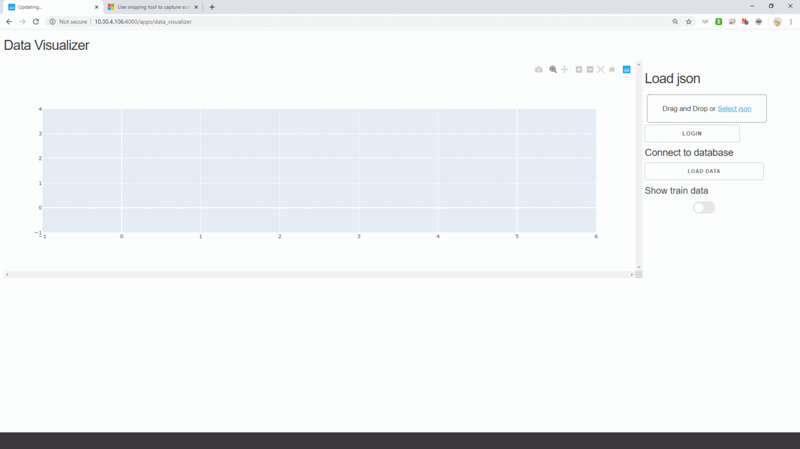

# gs_runner
gs_runner is a  grid search and training tool for time-series analysis.
Once installed, it is possible to inherit the gs_runner class to create
and run custom ML algorithms. Everything needed for the algorithm creation
should be written in the a proper .json file given as the argument for the
gs_runner class constructor under the ['model']['params'] key.
The data used for the training and test is specified under the ["data"] key in the json file.

## Installation

```bash
pip install gs_runner
```

## Usage

Here an axample of a proper formatted .json file used
to create a Keras LSTM model to perform training and forecasting
over the 'cpu_usagemhz_average' metric in the 'issue86_interpolated_train' table.
Since 'input_names' is a void list, the model will use the target metric as input metric also.
The results (.h5 serialized model files and .csv test predictions) are stored in the 'exp_folder' directory.

```json
{
    "data":{
        "table_train": "issue86_interpolated_train",
        "table_test": "issue86_test",
        "table_result": "issue86_prova_results",
        "target_name" : "cpu_usagemhz_average",
        "input_names" : [],
        "exp_folder": "/home/aritacco/LSTM/issue_86/LSTM_GS_result_PROVA/",
        "info": " "
    },
    "model":{
        "name":"dense",
        "training":{
            "n_epochs": 5,
            "validation_perc" : 0.15,
            "early_stop" : 1,
            "patience" : 10,
            "n_exp": 2
        },
        "params":{
            "n_in": [24, 168],
            "n_out": [24, 168],
            "num_hidden": [5,100],
            "num_layers": [2],
            "dropout": [0],
            "batch_size": [512],
            "activation": ["tanh"]
        }
    },
    "connection":{
        "database_username" : "voda",
        "database_password" : "issue86",
        "database_ip": "10.30.4.106",
        "database_name": "vodafone"
    }
  }
```
Since each model should have its own parameters it is important to specify all the parameters
needed for the model creation under the ['model']['params'] key.
You should use them for subclassing the created model(**params) function and use them
to return an instance of your model.

```python
class gs_runner_LSTM(gs_runner):

    def __init__(self,json_path):
        super().__init__(json_path)
        self.scaler = StandardScaler()

    def create_model(self,n_in=168, n_out=168,num_hidden=50, num_layers=1,dropout=0,batch_size=32, activation='tanh'):
        model = Sequential()
        if num_layers>1:
            model.add(LSTM(num_hidden,activation=activation,return_sequences=True, input_shape=(n_in,1)))
            if dropout>0:
                model.add(Dropout(dropout))
        else:
            model.add(LSTM( num_hidden, activation=activation,return_sequences= False, input_shape=(n_in,1)))
            if dropout>0:
                model.add(Dropout(dropout))

        for i in range(1,num_layers-1):
            model.add(LSTM( num_hidden,activation=activation, return_sequences=True))
            if dropout>0:
                model.add(Dropout(dropout))
        if num_layers>1:
            model.add(LSTM(num_hidden, activation=activation, return_sequences= False))
            if dropout>0:
                model.add(Dropout(dropout))

        model.add(Dense(n_out, activation='linear'))
        model.compile(loss='mse', optimizer='adam', metrics=['mae'])
        print(model.summary())
        return model

```
The train data creation should be done subclassing the create_train_data that
should use the n_in and n_out param to crate a proper training set. The last
n_in sample of the training set are returned as 'initial_seed' parameter
used for the forecast function.
*create_train_data* should return 3 numpy array :
-   Train_inputs
-   Train_targets
-   initial_seed (First sample used to forecast over the testset)

```python
class gs_runner_LSTM(gs_runner):

    def __init__(self,json_path):
        super().__init__(json_path)
        self.scaler = StandardScaler()

    def create_train_data(self, n_in: int, n_out:int) -> np.array:
            """[summary]
            Arguments:
                n_in {int} -- [num of input sample as input for the model]
                n_out {int} -- [num of model output]

            Returns:
                (train_X : np.array, train_y : np.array, inital_seed : pd.DataFrame)
            """


            sc_tr = self.scaler.fit(self.df_TRAIN[[self.name_target]].values.reshape(-1,1))
            values_train = sc_tr.transform(self.df_TRAIN[[self.name_target]].values.astype(dtype=float) )


            groups = list(range(0,values_train.shape[1]))
            n_features = len(groups)
            reframed_dataset = series_to_supervised_nan(values_train, n_in, n_out)
            reframed_columns = list(reframed_dataset.columns)
            target_var_label = 'var' + str(n_features)
            columns_to_drop = []
            for col_name in list(reframed_dataset.columns):
                is_forecasted_input = not (
                    target_var_label in col_name or '-' in col_name)
                if is_forecasted_input:
                    columns_to_drop.append(col_name)

            reframed_dataset.drop(columns_to_drop,axis=1,inplace=True)
            reframed_dataset.dropna(inplace=True)
            # split into train and validation sets
            values = reframed_dataset.values
            train = values
            n_features = 1
            n_obs = n_in*n_features # univariate

            train_X, train_y = train[:, :n_obs], train[:, -n_out:]
            # reshape input to be 3D [samples, timesteps, features]
            train_X = train_X.reshape(train_X.shape[0], n_in, n_features)
            print('Dataset Train shape X, Y: ',train_X.shape, train_y.shape)
            initial_seed = self.df_TRAIN[[self.nameFT]].iloc[-n_in:]
            return train_X, train_y, initial_seed


```
The function train_model takes in input the train_X and train_y from the *create_train_data*
function as well as the batch_size and of course the model, and return the number of epochs (mandatory),
the train and validation loss (not important at the moment, since the focus is on the test MAPE or MAE).
```python
class gs_runner_LSTM(gs_runner):

    def __init__(self,json_path):
        super().__init__(json_path)
        self.scaler = StandardScaler()


    def train_model(self, model,train_X : np.array, train_y : np.array,  batch_size: int):
            earlyStop=EarlyStopping(monitor="val_loss",verbose=0,mode='min',patience=self.gs_data['model']['training']['patience'], restore_best_weights=True)
            if self.gs_data['model']['training']['early_stop'] == 1:
                r = model.fit(train_X, train_y, epochs=self.gs_data['model']['training']['n_epochs'],
                                            verbose=0, shuffle=True, validation_split= self.gs_data['model']['training']['validation_perc'], batch_size=batch_size, callbacks=[earlyStop, TQDMCallback(leave_inner=False, leave_outer=True)])
            else:
                r = model.fit(train_X, train_y, epochs=self.gs_data['model']['training']['n_epochs'],
                                            verbose=0, shuffle=True, batch_size=batch_size, callbacks=[TQDMCallback(leave_inner=False, leave_outer=True)])
            es_epochs = len(r.history['loss'])
            train_loss = r.history['loss'][-1]
            validation_loss = r.history['val_loss'][-1]

            model.save(self.gs_data['data']['exp_folder']+'/'+current_execution+".h5")
            return {'time':train_time, 'epochs':es_epochs,'train_loss':train_loss, 'validation_loss':validation_loss}


```
Since each model can make a number of prediction in one step, the forecast function takes in input the
param 'n_steps' (test.shape / model.n_out) and the param 'n_remaining' (test.shape % model.n_out).
In this case to fill the prediction array the model makes n_steps predictions using a sliding
window to replace the initial_seed value with the current predictions. The remaining test predictions are
made out of the loop, taking the first n_remaining samples from the last prediction.

```python

class gs_runner_LSTM(gs_runner):

    def __init__(self,json_path):
        super().__init__(json_path)
        self.scaler = StandardScaler()


    def forecast(self, model, init_seed: np.array, n_steps: int , n_remaining: int) -> np.array:
        """[summary]
        Forecast values using model, and for a number of times specified by n_forecast

        Arguments:
            model {[type]} -- [a class with the method 'predict(initial_seed)' to make predictions -
                                             i.e. : tensorflow.keras.models.Sequential()]
            initial_seed {np.array} -- [the input array used to start the forecasting loop]

            n_steps {int} -- [number of predictions ]

            n_remaining {int} -- [number of remaining sample to predict]
        Returns:
            np.array -- [returns the forecasted time-series with a dimension specified by n_forecast]
        """
        initial_seed = self.scaler.transform(np.array(init_seed))
        n_out = model.output_shape[1]
        n_in = model.input_shape[1]
        predictions = []
        for i in range(n_steps):
            _pred = model.predict(initial_seed.reshape(1,n_in,1)).flatten()
            initial_seed = np.concatenate((initial_seed[n_out:].flatten(), _pred[:n_in]))
            predictions.append(self.scaler.inverse_transform(_pred.reshape(-1,1)).flatten())
        if n_remaining > 0:
            _pred = model.predict(initial_seed.reshape(1,n_in,1)).flatten()
            predictions.append(self.scaler.inverse_transform(_pred[:n_remaining].reshape(-1,1)).flatten())
            return np.concatenate(np.array(predictions).flatten()).reshape(-1,1)
        else:
            return np.array(predictions).flatten().reshape(-1,1)

```
## Example of use

To use launch a grid search campaign or a single training experiment, you should
simply create a new GS_runner subclass (here and LSTM based one in models/gs_runner_LSTM.py)
and pass it the corresponding .json config path.

```python
import numpy as np
import json
import sys

from models.gs_runner_LSTM import gs_runner_LSTM


if __name__ == "__main__":
    json_path = sys.argv[1]
    runner = gs_runner_LSTM(json_path = json_path)
    runner.run()
```

## Result visualization
To have a nice visualization of the grid search results, you can go to : http://10.30.4.106:4080/apps/data_visualizer
and load a .json grid search file (used for past and current experiments) and see the corresponding sql experiment table
as well as the prediction results in a plot vs the test target.


